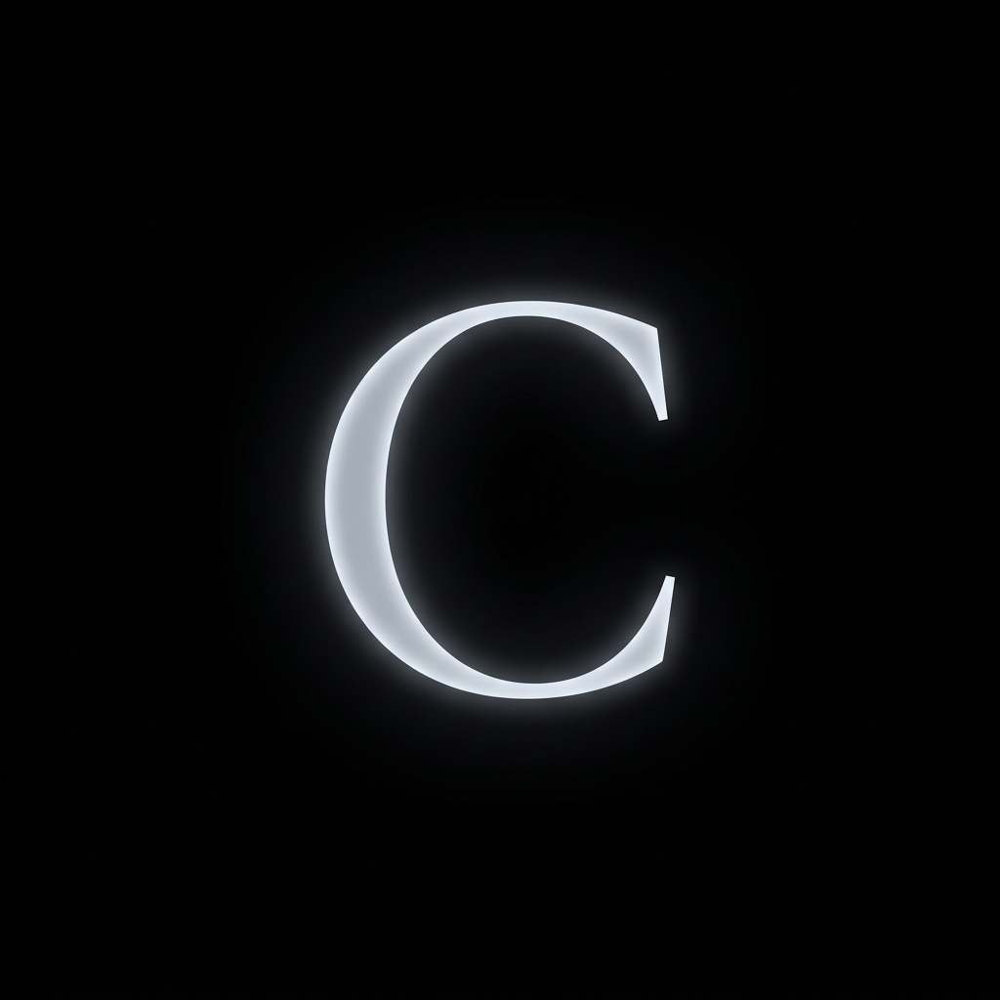
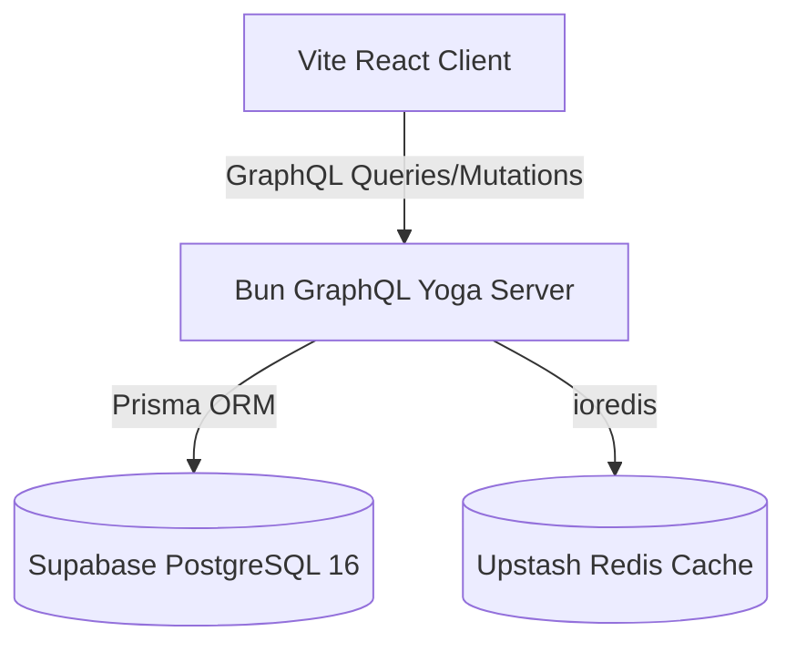

<div align="center">
  
  
  <h1 align="center">⚡ ChronoType</h1>
  <p align="center"><strong>A High-Performance, Awwwards-Caliber Speed Typing Arena</strong></p>

  <p align="center">
    <a href="https://chronotype-rust.vercel.app/"><strong>Live Demo (Vercel)</strong></a> · 
    <a href="https://chronotype-backend.onrender.com/graphql"><strong>GraphQL API (Render)</strong></a>
  </p>

  <p align="center">
    
    
    
    
    
    
    
  </p>
</div>

---

## 📖 Overview

**ChronoType** is a state-of-the-art typing simulation game engineered to evaluate full-stack architectural limits, database performance, secure authentication, and high-fidelity frontend micro-interactions. Moving away from standard component libraries, ChronoType utilizes a custom Vanilla CSS design system to deliver an uncompromised, cinematic "glassmorphic" experience with procedural audio feedback.

---

## 📸 Showcase

> **Note:** Add your production screenshots here.

<div align="center">
  
  <br/>
  <em>Cinematic Hero HUD & 3D Virtual Keyboard</em>
</div>
<br/>
<div align="center">
  
  <br/>
  <em>Global Network State: The Hall of Velocity</em>
</div>

---

## 🚀 Key Features & Engineering Highlights

### 🎨 Frontend: Antigravity UI & Sensory Feedback
- **Zero-Dependency Procedural Audio**: A pure Web Audio API engine generates dynamic mechanical keyboard "thocks", pitch-shifted error buzzers, and harmonic success chords—all executed locally without external MP3 file bloat.
- **Strict Game Engine**: Implements a rigorous 20-character sequence (A-Z) with instantaneous visual/auditory penalty enforcement (+0.5s per mistake). Backed by an ultra-precise `requestAnimationFrame` performance stopwatch.
- **Orthographic 3D Virtual Keyboard**: Features a fully reactive, isometric 3D CSS rendering of a mechanical keyboard that physically depresses in real-time to user keystrokes.
- **Particle Mesh Background**: A high-performance 2D Canvas ambient grid that responds kinetically to mouse velocity.
- **Awwwards-Grade Typography & Motion**: Clean, minimalist orthographic aesthetic combining `Instrument Serif`, `Inter`, and `JetBrains Mono` with meticulously timed entry/exit animations.

### ⚙️ Backend: High-Throughput GraphQL Engine
- **Bun + GraphQL Yoga**: Replaces traditional Node.js setups with Bun's ultra-fast runtime, serving a fully strongly-typed GraphQL API with millisecond cold starts.
- **Server-Side Anti-Cheat**: The backend executes rigorous mathematical validations on submitted runs (`expectedPenalty = wrongAttempts * 0.5s`, `expectedTotal = rawTime + expectedPenalty`) before recording a score.
- **Composite Database Indexing**: PostgreSQL (hosted on Supabase) utilizes highly optimized composite indexes to instantly compute rank sorting based on `userId`, `totalTime`, and `completedAt`.
- **JWT Cryptography**: End-to-end cryptographic identity verification using `jose` for JSON Web Tokens and `bcrypt` (cost 10) for password hashing.
- **Serverless Redis Caching**: Integrates Upstash Redis via `ioredis` to cache the global Top 50 Leaderboard, guaranteeing near-instantaneous `O(1)` query response times under heavy traffic loads.

---

## 🏗️ Technical Architecture



---

## 🚦 Running Locally

### Option 1: Docker (One-Click Launch)
Ensure Docker is installed and running, then execute:
```bash
docker-compose up --build
```
- **Frontend**: `http://localhost:5173`
- **Backend API**: `http://localhost:4000/graphql`
- **Database**: `localhost:5432`

### Option 2: Manual Setup

**Backend Initialization:**
```bash
cd backend
bun install
cp .env.example .env # Configure your Supabase/Upstash keys here
bun run db:push      # Push Prisma schema
bun run dev
```

**Frontend Initialization:**
```bash
cd frontend
npm install
npm run dev
```

---

## 🧪 Automated Test Coverage
Both environments have dedicated test suites ensuring the integrity of the core logic.

- **Backend (Bun Test):** `bun test` verifies JWT logic, penalty mathematics, duplicate email rejection, and leaderboard SQL aggregation logic.
- **Frontend (Vitest):** `npm test` asserts strict 20-character sequence boundaries, high-score tracking in `localStorage`, and accurate WPM telemetry calculations.

---

<div align="center">
  <p>Designed and Built by <strong>Anubhab</strong></p>
</div>
